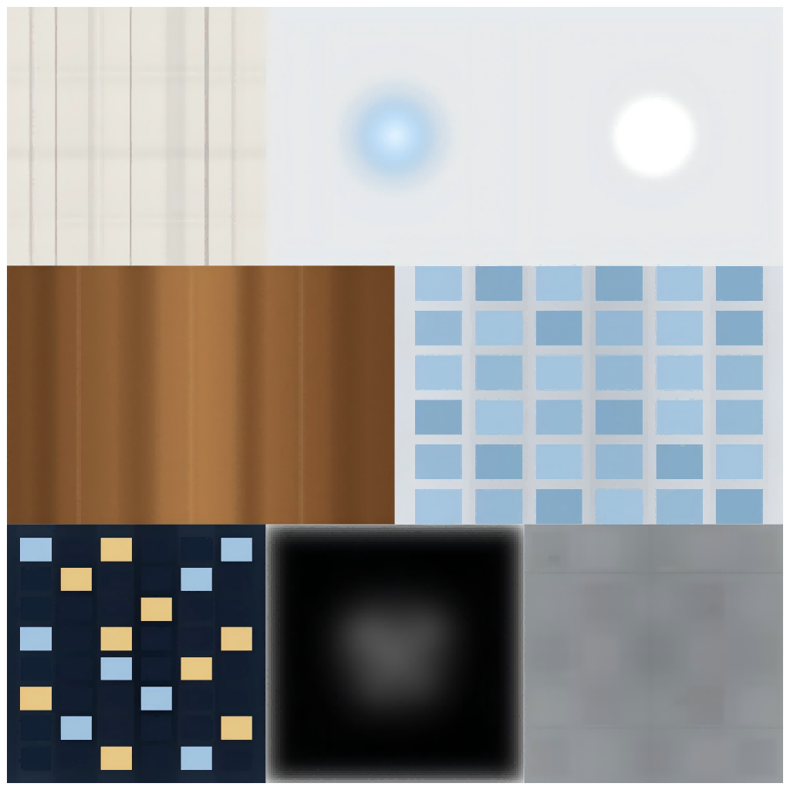

# texture-mcp

[](https://www.npmjs.com/package/texture-mcp)



A procedural 2D VFX texture generator exposed via MCP, using presets and recipes to produce controllable and reproducible visual assets for AI workflows.

## What It Provides

- Built-in semantic presets that compile into deterministic recipes.
- A small flat recipe DSL for controllable 2D texture composition.
- MCP tools for discovery, validation, generation, and export.
- Reproducible output with an explicit or fixed default `seed`.

## Current Scope

Current built-in presets:

- `flare`
- `glow`
- `ring`
- `smoke`
- `softMask`
- `shockwave`
- `panel`
- `beam`
- `colorRamp`

Current recipe layer types:

- `gradientCircle`
- `circle`
- `ring`
- `rect`
- `gradientRect`
- `text`
- `noise`
- `blur`

Current MCP tools:

- `get_workspace_info`
- `list_presets`
- `get_preset_schema`
- `list_layer_types`
- `get_layer_schema`
- `validate_recipe`
- `generate_texture`
- `export_texture`

Current MCP resources:

- `texture://docs/layer-reference`
- `texture://docs/preset-playbook`
- `texture://docs/recipe-examples`
- `texture://docs/workflow-guardrails`

Current MCP prompts:

- `recommended_preset_workflow`
- `recommended_recipe_workflow`

Notes:

- The recipe DSL is intentionally small and flat.
- `noise` and `blur` are full-canvas effect layers, not local shape modifiers.
- `text` uses canvas font-family strings, so rendering may vary slightly across hosts depending on available fonts.
- `export_texture` only writes to relative paths inside `workspaceRoot`.

## Reference Docs

For stable, separately linkable reference material, see:

- [docs/layer-reference.md](docs/layer-reference.md)
- [docs/preset-playbook.md](docs/preset-playbook.md)
- [docs/recipe-examples.md](docs/recipe-examples.md)

## Quick Start

### VS Code Copilot

Add the following to your `.vscode/mcp.json` (create it if it doesn't exist):

```json
{
  "servers": {
    "texture-mcp": {
      "command": "npx",
      "args": ["-y", "texture-mcp"]
    }
  }
}
```

Alternatively, add it to your User Settings (`settings.json`):

```json
{
  "mcp": {
    "servers": {
      "texture-mcp": {
        "command": "npx",
        "args": ["-y", "texture-mcp"]
      }
    }
  }
}
```

### Other Clients

Other MCP clients (Claude Desktop, Cursor, Windsurf, etc.) should configure the server according to their own MCP integration conventions. The server command is:

```
npx -y texture-mcp
```

The transport is **stdio**.

If your MCP host does not launch the server with the intended project directory as its current working directory, set `TEXTURE_MCP_WORKSPACE` explicitly before starting the server so `export_texture` uses the correct sandbox root.

### Stdio Compatibility

Different MCP hosts do not always frame stdio messages in exactly the same way.

- Some hosts send newline-delimited JSON messages.
- Some hosts send JSON-RPC messages with `Content-Length` headers.

This project intentionally uses a custom stdio transport that accepts both framing styles and replies in the same framing style used by the client. This compatibility layer exists because the `@modelcontextprotocol/sdk` stdio transport used during development did not reliably cover both host behaviors out of the box.

If a host can connect in one environment but fails the MCP handshake in another, first verify that you are running a build that includes this compatibility transport. During local development, prefer the compiled local entry instead of assuming an older published npm version already contains the latest MCP transport fixes.

### Usage Flow

Once connected, the simplest user flow is:

1. Ask the client to list presets or layer types.
2. Optionally call `get_workspace_info` to confirm the current export root.
3. Inspect one preset or layer schema.
4. Validate a recipe if you are using `recipe` mode.
5. Generate a texture.
6. Export the current result to a relative path inside the workspace.

Use `preset` mode when you want the fastest path to a useful result.
Use `recipe` mode when you want direct control over layer composition.
`generate_texture` validates the selected mode strictly and rejects mixed preset/recipe input in the same call.

## Local Development

```bash
npm install
npm run build
```

Register the local compiled entry during development:

```bash
codex mcp add texture -- node /path/to/dist/mcp/index.js
```

This is also the recommended way to verify MCP handshake behavior in Codex after local transport changes, because `npx -y texture-mcp` may resolve to an older published package version.

Run the local server entry:

```bash
npm start
```

Run the current smoke and integration tests:

```bash
npm test
```

## Recommended Workflow

For AI callers, the recommended sequence is:

1. `list_presets` or `list_layer_types`
2. `get_preset_schema` or `get_layer_schema`
3. `validate_recipe`
4. `generate_texture`
5. `export_texture`

Use presets when you want a fast semantic starting point.
Use recipe mode when you need precise control over layer composition.

The server also exposes runtime-generated MCP resources and prompts for these workflows, so callers can read reference material directly without depending on local `docs/*.md` files.

## Resources And Prompts

The server exposes stable, runtime-generated discovery content in addition to tools.

Resources:

- `texture://docs/layer-reference`
- `texture://docs/preset-playbook`
- `texture://docs/recipe-examples`
- `texture://docs/workflow-guardrails`

Prompts:

- `recommended_preset_workflow`
- `recommended_recipe_workflow`

Resources are returned as `text/markdown` and are generated at runtime from the server's structured metadata and fixed example content. They do not depend on the repository `docs/` directory being present in the published package.

## Structured Output Highlights

The tools return stable `structuredContent` intended for MCP callers.

- `list_presets` returns `count` and `presets`.
- `get_workspace_info` returns `workspaceRoot`, `workspaceRootSource`, `cwd`, and `exportPolicy`.
- `list_presets` preset items also include `primaryParams` and `commonUses` to help pick the best semantic starting point.
- `get_preset_schema` returns full preset schema metadata plus summary fields such as `mode`, `paramCount`, `paramNames`, `requiredParamNames`, `schemaRequiredParamNames`, `defaultParamNames`, `parameterSemantics`, `commonUses`, `tuningNotes`, and `compilesToLayerTypes`.
- `list_layer_types` returns `count` and `layers`.
- `list_layer_types` layer items also include `applicationScope`, `primaryParameters`, and `commonUses` to help choose between local draw layers and fullscreen effects.
- `get_layer_schema` returns full layer semantics plus summary fields such as `mode`, `primaryParameters`, `parameterNames`, `requiredParameterNames`, `constraintFields`, `applicationScope`, and `exampleCount`.
- `validate_recipe` returns `valid`, `errorCount`, `readyForGeneration`, `errors`, and when valid also `normalizedRecipe` and `stats`.
- `generate_texture` returns `mode`, `width`, `height`, `preset`, `seed`, `usedDefaultSeed`, `recipeLayerCount`, and `currentResultAvailable`.
- `export_texture` returns `savedPath`, `metaPath`, `width`, `height`, `format`, `sourceMode`, `preset`, `seed`, and `metaSaved`.

## Example: Discover A Preset

List available presets:

```json
{
  "tool": "list_presets",
  "arguments": {}
}
```

Inspect one preset:

```json
{
  "tool": "get_preset_schema",
  "arguments": {
    "preset": "beam"
  }
}
```

`get_preset_schema` also returns summary fields that are easier to consume than raw JSON Schema:

- `mode`
- `paramCount`
- `paramNames`
- `requiredParamNames`
- `schemaRequiredParamNames`
- `defaultParamNames`
- `defaultParams`
- `parameterSemantics`
- `primaryParams`
- `commonUses`
- `tuningNotes`
- `compilesToLayerTypes`

`requiredParamNames` reflects what the caller must still provide explicitly after preset defaults are applied.
`schemaRequiredParamNames` reflects the raw underlying schema before defaults are merged.

Typical `beam` parameters:

```json
{
  "orientation": "horizontal",
  "length": 0.85,
  "thickness": 0.14,
  "intensity": 0.85
}
```

## Example: Check The Current Export Root

```json
{
  "tool": "get_workspace_info",
  "arguments": {}
}
```

Use this when a host launches the MCP server from an unexpected directory or when you need to confirm which sandbox root `export_texture` will enforce.

## Example: Discover Recipe Layers

List supported layer types:

```json
{
  "tool": "list_layer_types",
  "arguments": {}
}
```

Inspect one layer type:

```json
{
  "tool": "get_layer_schema",
  "arguments": {
    "type": "gradientRect"
  }
}
```

`get_layer_schema` also returns high-signal summary fields:

- `mode`
- `primaryParameters`
- `parameterNames`
- `requiredParameterNames`
- `constraintFields`
- `applicationScope`
- `exampleCount`
- `parameterSemantics`
- `constraints`
- `examples`

## Example: Validate A Recipe First

```json
{
  "tool": "validate_recipe",
  "arguments": {
    "recipe": {
      "version": 1,
      "layers": [
        {
          "type": "gradientRect",
          "origin": { "x": 0.08, "y": 0.43 },
          "size": { "width": 0.84, "height": 0.14 },
          "direction": "horizontal",
          "colors": [
            "rgba(0, 220, 255, 0)",
            "rgba(120, 235, 255, 0.65)",
            "rgba(255, 255, 255, 1)",
            "rgba(120, 235, 255, 0.65)",
            "rgba(0, 220, 255, 0)"
          ]
        },
        {
          "type": "blur",
          "radius": 0.04
        },
        {
          "type": "rect",
          "origin": { "x": 0.08, "y": 0.485 },
          "size": { "width": 0.84, "height": 0.03 },
          "color": "rgba(255, 252, 245, 0.9)"
        }
      ]
    }
  }
}
```

When valid, `validate_recipe` returns:

- `valid`
- `errorCount`
- `readyForGeneration`
- `errors`
- `normalizedRecipe`
- `stats`

## Example: Generate From A Preset

```json
{
  "tool": "generate_texture",
  "arguments": {
    "mode": "preset",
    "preset": "colorRamp",
    "params": {
      "palette": "heat",
      "orientation": "horizontal",
      "thickness": 0.16,
      "padding": 0.08,
      "cornerRadius": 0.03
    },
    "width": 512,
    "height": 128,
    "seed": 7
  }
}
```

`generate_texture` returns structured fields such as:

- `mode`
- `width`
- `height`
- `preset`
- `seed`
- `usedDefaultSeed`
- `recipeLayerCount`
- `currentResultAvailable`

## Example: Generate From A Recipe

```json
{
  "tool": "generate_texture",
  "arguments": {
    "mode": "recipe",
    "recipe": {
      "version": 1,
      "layers": [
        {
          "type": "gradientCircle",
          "center": { "x": 0.5, "y": 0.5 },
          "radius": 0.42,
          "colors": [
            "rgba(255, 245, 210, 0.95)",
            "rgba(255, 180, 80, 0)"
          ]
        },
        {
          "type": "noise",
          "amount": 0.12
        }
      ]
    },
    "width": 512,
    "height": 512,
    "seed": 12
  }
}
```

`export_texture` returns structured fields such as:

- `savedPath`
- `metaPath`
- `width`
- `height`
- `format`
- `sourceMode`
- `preset`
- `seed`
- `metaSaved`

`generate_texture` stores the result as the current in-memory texture state. `export_texture` then writes that current result to disk.

## Example: Export The Current Result

```json
{
  "tool": "export_texture",
  "arguments": {
    "outputPath": "outputs/beam-01.png",
    "format": "png",
    "saveMeta": true
  }
}
```

For JPEG or WebP output:

```json
{
  "tool": "export_texture",
  "arguments": {
    "outputPath": "outputs/panel-01.webp",
    "format": "webp",
    "quality": 0.92,
    "saveMeta": true
  }
}
```

## Guardrails

- Width and height are bounded.
- Total texture area is bounded.
- Total layer count is bounded.
- Output paths must stay inside `workspaceRoot`.
- `workspaceRoot` is resolved from an explicit server setting first, then `TEXTURE_MCP_WORKSPACE`, and finally the server process `cwd`.
- If `seed` is omitted, a fixed default seed is used so results remain reproducible.

## Status

The package is published on npm and can be used directly through `npx -y texture-mcp`. Local development through the compiled entry is also supported.
